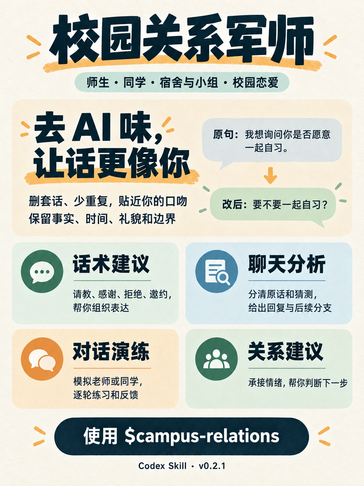

# 校园关系军师

把关系维护做在日常小事里：问得清楚、做得可靠、留有边界。

面向大学生的 Codex Skill，帮助处理师生、同学关系，也支持校园心动与恋爱。融合 [狗头军师](https://github.com/shengjidaguai-china/goutoujunshi) 的情绪支持、关系判断、聊天分析、话术编排和反馈策略，保留校园版的日常维护、合作与边界。

**版本：v0.2.2 · 内部名称：`campus-relations` · 许可：MIT**



海报沿用 v0.2.1 设计，当前技能版本为 v0.2.2。

## 可以这样问

```text
使用 $campus-relations：我想请教任课老师，但怕问题太基础。
我已经看过课件，卡在作业第二步，帮我写一条自然的消息。
```

```text
使用 $campus-relations：认识一个选修课同学，想约他一起自习。
我们只聊过两次，希望邀请轻松一点，不让人有压力。
```

```text
使用 $campus-relations：我是学习委员，最近备考，班务又多。
怎样和老师说明我能承担的范围，也把交接安排好？
```

```text
使用 $campus-relations：我们小组一开始分工没说清，大家都觉得自己做得多。
怎么重新确认任务，保住合作关系？
```

```text
使用 $campus-relations：我喜欢同班一个男生，我们聊过几次电影。
想约他看校内放映，帮我写自然的邀请，也说说不同回应下怎么接。
```

```text
使用 $campus-relations：陪我练一次向老师请假的对话。
我计划去北京旅行两天，你每轮只扮演老师回一句，再指出我的表达怎么改。
```

```text
使用 $campus-relations：今天拒绝了室友让我带饭的请求，心里还是不自在。
我现在只想说说，先别给建议，跟我说话短一点。
```

同一聊天可以继续说“这句不像我，给同学写短一点，不要波浪号”“我还没发，先准备一句备用回复”，或贴出对方的实际回复。需要更正时直接说明哪一处说错了，不必重新讲一遍背景。

## 它会怎样帮你

| 场景 | 重点 |
|---|---|
| 请教、约答疑、反馈与感谢 | 背景清楚、问题具体、尊重已有联系约定 |
| 认识同学、维护友谊 | 共同情境、自然联系、可以拒绝的邀请 |
| 宿舍相处 | 作息、卫生、物品、隐私的具体约定 |
| 小组、班委、社团合作 | 分工、交付、感谢与合理投入 |
| 拒绝、分歧、误会 | 说清范围、具体补救、后续协商 |
| 心动、邀约、恋爱、退出 | 合适的主动、真实反馈、双方意愿与校园共处 |
| 聊天截图与文件 | 先确认说话人，分清原话、转述与未知，再给回复 |
| 开口紧张、接话和对话演练 | 现场取材、口吻校准、一轮一条和具体反馈 |

只要一句回复时先给草稿。需要分析时分清事实和未知，给首选行动和观察条件；根据真实反馈调整。普通同学关系、喜欢独处、老师暂时没空，都可以是正常情况。
明确只想交朋友就按友谊目标处理；用户谈心动和恋爱时才进入恋爱线。不会把帮忙、感谢或聊天频率自动解释成暧昧。

v0.2.1 融入 humanizer-zh 的中文表达检查：少写空泛铺垫和重复，按用户的口吻给成稿。师生请求保留必要礼貌，拒绝与协作保留真实时间、范围和条件；不为显得自然强加语气词、亲密感或经历。调用 `$campus-relations` 即可，无需再叠加另一个技能。

v0.2.2 加强连续对话：沿用用户明确的口吻偏好，区分草稿、已发送与对方实际回复，收到纠正后更新对应事项。说“先别给建议”时可以先倾听；演练中可暂停询问、继续扮演，并按用户选择在结束后复盘。对外名称统一为“校园关系军师”，调用名称不变。

本版使用当前聊天可见的背景，**没有跨聊天长期记忆**。所有示例是原创，研究是设计参考；没有研究验证过本 Skill 能改善真实校园关系。

## 安装

需要 Codex；安装和项目校验脚本需要 Python 3.10 或更新版本，无额外 Python 包。技能日常回答不需要执行 Python。

下载或克隆本项目后，在项目目录运行：

```powershell
python scripts/install_skill.py
```

默认安装到 `CODEX_HOME/skills/campus-relations`；未设置 `CODEX_HOME` 时，安装到用户目录下 `.codex/skills/campus-relations`。已有同名目录会停止，不覆盖内容。指定另一技能根目录：

```powershell
python scripts/install_skill.py --skills-dir "D:/my-codex/skills"
```

也可以手动把 `SKILL.md`、`agents/`、`references/`、`scripts/`、`LICENSE`、`NOTICE.md` 放在技能根目录中的 `campus-relations/` 文件夹里。

在 Codex 中调用 `$campus-relations`。若技能列表暂未出现，先按实际安装目录核对文件，再重新打开聊天或应用查看。

更新时先保存已有安装中的个人修改，再单独替换；安装器不提供强制覆盖。卸载只需移除已安装的 `campus-relations` 文件夹，项目源码可以保留。

## 项目内容

- [技能入口](SKILL.md)：场景、决策流程、资料路由。
- [师生关系](references/practical/teacher-relations.md)、[同学关系](references/practical/peer-relations.md)、[修复与边界](references/practical/repair-and-boundaries.md)：具体行动与原创话术。
- [话术编排](references/practical/conversation-playbook.md)：主动作、三层表达、口吻变体、反馈分支和逐轮演练。
- [中文表达整合](docs/natural-style-update.md)：humanizer-zh 的保真、口吻和成稿检查，以及 6 个针对场景的实际结果。
- [连续对话更新](docs/continuity-update.md)：v0.2.2 的口吻沿用、实际反馈、倾诉与演练改进，包含本轮验证范围和结果。
- [聊天分析](references/practical/chat-analysis.md)、[社交校准](references/practical/social-calibration.md)：原版通用能力的校园化改写。
- [校园恋爱](references/practical/campus-romance.md)：心动、邀请、确认、投入调整、分歧与退出。
- [研究依据](references/knowledge/evidence.md)：论文、核验范围与适用限制。
- [完整资料索引](docs/research-index.md)：8 个案例来源、10 篇核心论文与 1 篇补充研究。
- [使用示例](docs/examples.md)：四种典型请求的回答形态。
- [20 个验收场景](tests/scenarios.md)：12 日常维护、4 修复、4 边界。
- [8 个融合场景](tests/fusion-scenarios.md)：校园事务与恋爱路由、含糊回应、拒绝与聊天证据。
- [3 组连续对话](tests/multi-turn-scenarios.md)：每组 5 次用户输入，检查口吻沿用、草稿和实际反馈、用户纠正、倾诉转建议及演练复盘。
- [二创来源](docs/provenance.md)：固定上游版本及改写范围。
- [本次融合说明](docs/fusion-design.md)：v0.2 范围与模块职责。
- [设计](docs/superpowers/specs/2026-10-03-campus-relations-design.md)与[实施计划](docs/superpowers/plans/2026-10-03-campus-relations-plan.md)。

`docs/`、`tests/` 和 README 用于开发与公开介绍，安装器不将它们放入技能运行目录。每次回答按场景选读资料，通常 1–3 份。

## 开发验证

```powershell
python scripts/validate_skill.py . --project
python -m unittest discover -s tests -p "test_*.py"
```

结构与工具测试检查引用、标识、安装完整性和不覆盖行为。行为验收须实际运行场景并审阅回答，不能只凭脚本检查判断咨询质量。
v0.2.2 完成 3 组各 5 轮连续对话，均达到行为标准，独立复核和安装一致性检查通过；两组首轮与后续之间有一次入口措辞修订，见[本次记录](docs/continuity-update.md)。未重跑旧版单轮套题，不作真实关系效果保证。
v0.2.1 完成 6 个中文表达针对场景，均达到各题标准，结构与新安装校验通过，见[本次记录](docs/natural-style-update.md)。旧版 28 题没有在这次更新中重跑。
v0.2.0 的实际结果见[融合验证记录](docs/fusion-validation-report.md)：20 个校园场景达到门槛，8 个融合场景初轮 7 个通过，请假对象的默认假设修正后复测通过。工具测试 13 项通过、1 项因 Windows 符号链接权限跳过。v0.1.0 的[历史验证](docs/validation-report.md)单独保留。

欢迎提交新的**原创、去除身份信息**的测试场景，说明原输入、实际回答以及具体不妥之处。研究补充请附作者、题名、链接、设计和适用限制。不要上传私人聊天、真实学生身份或第三方论文全文。

## 许可与归属

校园版是独立衍生项目。保留原版 `Copyright (c) 2026 powerycy` 与 MIT 许可，见 [LICENSE](LICENSE) 和 [NOTICE.md](NOTICE.md)。引用论文、教育案例和网页的各自权利不因本项目 MIT 而改变。

humanizer-zh 表达原则的整合另保留本地许可中的 `Copyright (c) 2026 歸藏`；来源与本地修订哈希见[二创记录](docs/provenance.md)。
